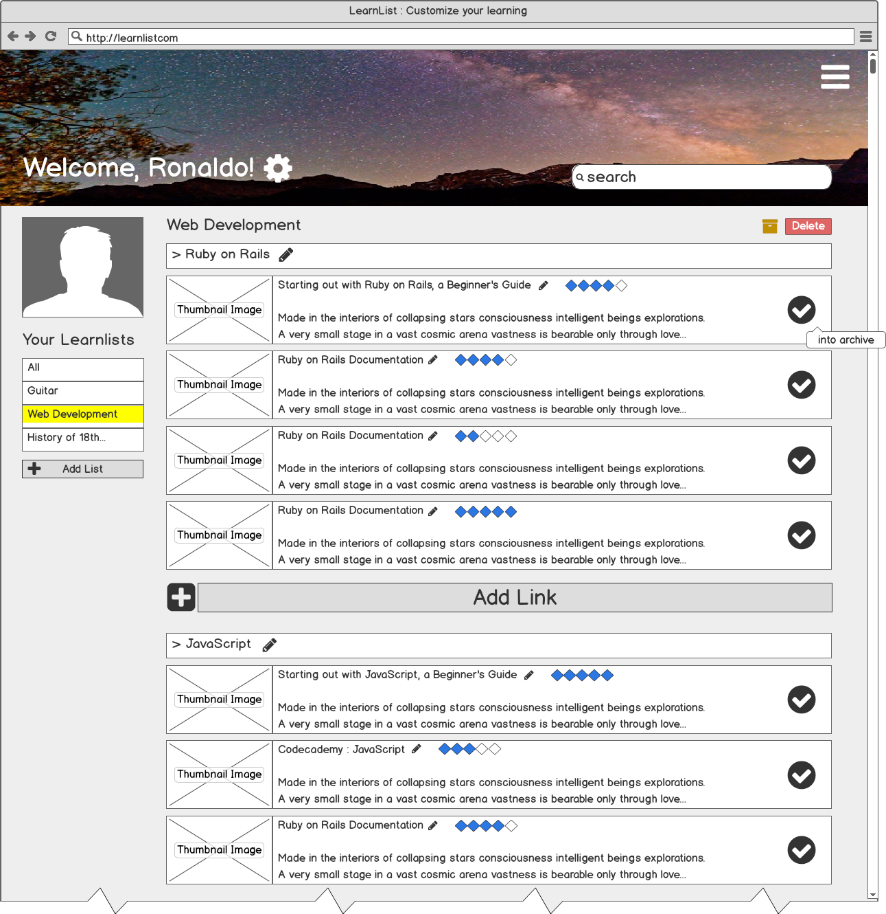
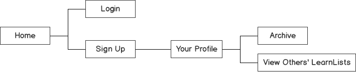

#LEARNLIST README

##Overview

Learnlist is an application that allows you to store all of your
online learning resources in one place.  Its design is based off
music listening apps with customized, user-created playlists, except
its focus is on learning and finding the best resources out there.

##Technologies

* Ruby, using a Rails framework
* bcrypt gem for password protection
* Postgresql for running a database
* ActiveRecord for database manipulation
* JavaScript & jQuery for front-end interaction
* HTML/CSS & ERB
* Balsamiq for wireframing

##Mockup and Sitemap

This is a preliminary wireframe of the Learnlist User Dashboard. Users will be able to create lists, add links, rate the
resources, and search for other resources that their fellow learners post.

This is a view of the MVP sitemap. In order to use the application, you must be logged in.
